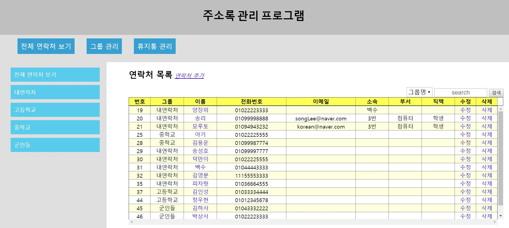

# addressbook
Web Programming을 통하여 Web Page 내에서 주소록을 관리

    

## Guide
- [storyBoard](./storyboard.pdf)
- [implementation](./addressbook) ([jsp](./addressbook/WebContent) & [java](./addressbook/addressbook/src/mybean/db))
- [explain implementation](./result_report.pdf)
- [DB structure](./db_structure)

## Enviroment
 - Eclips Neon
   - 웹을 디자인하고 제어하기 위한 CSS, JSP 사용
   - Tomcat server 관리
- Mysql
   - DB를 관리하기 위한 RDBMS

## Install
- CSS, JSP
  - addressbook.war file 다운로드
  - 이클립스에서 File->import를 통해 다운받은 war file 선택
- DB
  - addressbook.sql 다운로드
  - addressbook DateBase 생성 후 addressbook.sql 실행
  
